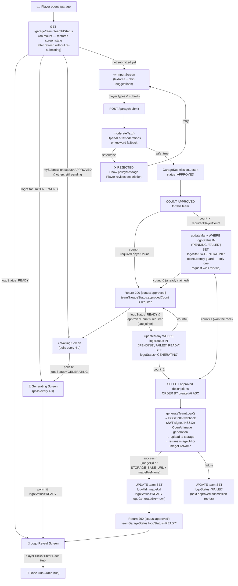
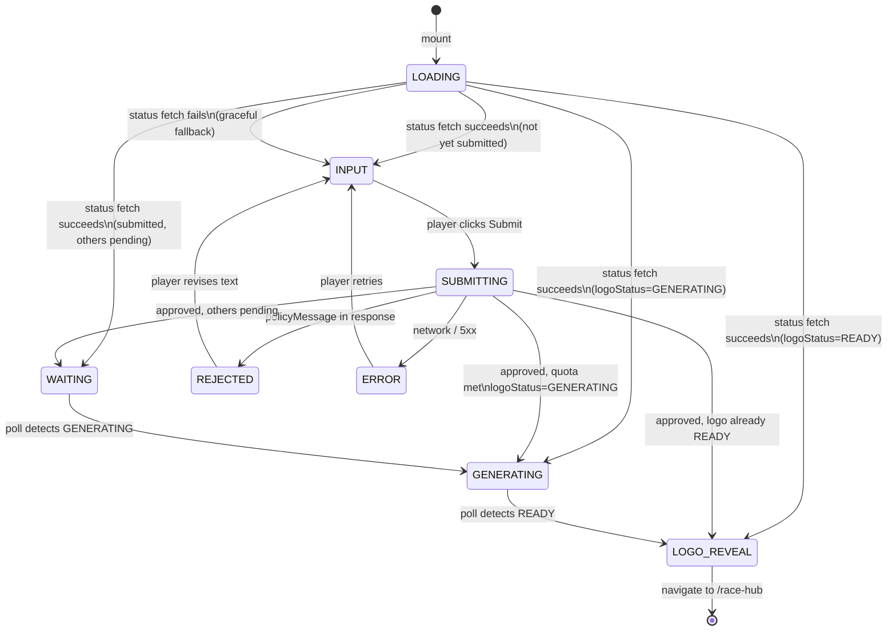

# Garage Workflow — Architecture & Flow

## Purpose

The Garage screen is the first screen every player sees after following their team link.
Each player writes a few words describing themselves.  Once all required teammates
have submitted, a shared team logo is generated via AI and revealed to everyone.

---

## System-Wide Flow



---

## UI State Machine



---

## Module Map

```
packages/api-contract/
  src/contracts/garage.ts          ← shared TypeScript types (GarageSubmitRequest, TeamGarageStatus, …)
  src/schemas/garageSchemas.ts     ← Zod validation schemas consumed by API validate() middleware

apps/api/
  prisma/schema.prisma             ← GarageSubmission model + Team garage fields
  src/config/env.ts                ← Garage env vars: N8N_IMAGE_API_URL, N8N_IMAGE_API_KEY,
                                     OPENAI_API_KEY, GARAGE_REQUIRED_PLAYER_COUNT
  src/services/moderationService.ts  ← OpenAI /v1/moderations call (keyword fallback in dev)
  src/services/garageService.ts      ← core business logic: submit, quota check, logo trigger
  src/services/n8nService.ts         ← n8n webhook client for logo generation (JWT-signed, dev fallback)
  src/routes/garage.ts               ← POST /garage/submit,  GET /garage/team/:id/status
  src/routes/index.ts                ← garageRouter registered here

apps/web/
  src/hooks/usePlayerSession.ts         ← reads playerId/teamId/eventId from auth session (dev fallback)
  src/services/garage/garageService.ts  ← typed HTTP wrappers (submit, getTeamStatus)
  src/app/pages/Garage.tsx              ← UI state machine + render branches
```

---

## Database Tables Involved

| Table | Purpose |
|---|---|
| `Team` | Holds `requiredPlayerCount`, `logoUrl`, `logoStatus`, `logoGeneratedAt` |
| `GarageSubmission` | One row per (player, team) — `APPROVED` rows count toward quota. Tracks `moderatedAt` timestamp for audit. |
| `Player` | Looked up for `totalMembers` count |
| `Event` | FK on GarageSubmission |

---

## Concurrency Note

Two players submitting at the same millisecond could both see `approvedCount >= requiredPlayerCount`.
The logo generation race is resolved by a conditional `updateMany` that only flips `logoStatus` from
`PENDING|FAILED → GENERATING` (or `PENDING|FAILED|READY → GENERATING` for late-joiner re-generation).
Prisma returns `count` of updated rows — only the winner (`count=1`) proceeds to call n8n.  The loser
exits silently.  The winner's n8n call is dispatched via `setImmediate()` (fire-and-forget) and runs
to completion, setting `logoStatus=READY`; subsequent polls on either player's client will see the result.

---

## Re-generation on Late Joiners

`triggerLogoGeneration` always collects **all current APPROVED descriptions** before building the
prompt, not just the one that just came in.  This means:

- When Player 3 submits after Player 1 & 2 already have a logo, a new generation is fired.
- The new logo includes all three descriptions.
- Both old and new players see the updated logo on their next poll.

This is intentional and matches the spec requirement:
> "once a new member joins the new logo needs to be generated and updated on the team pic"
