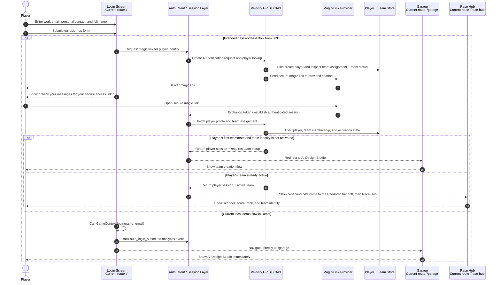
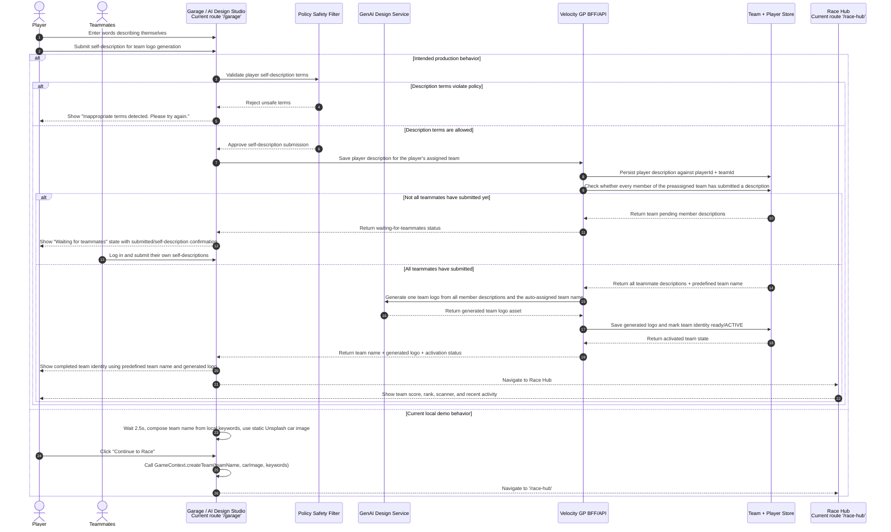
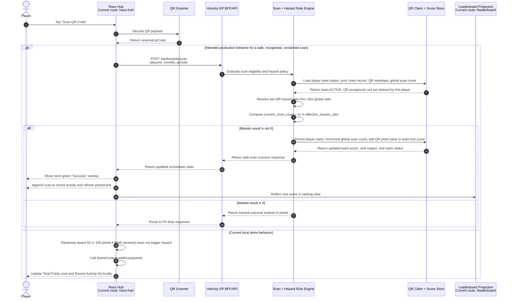
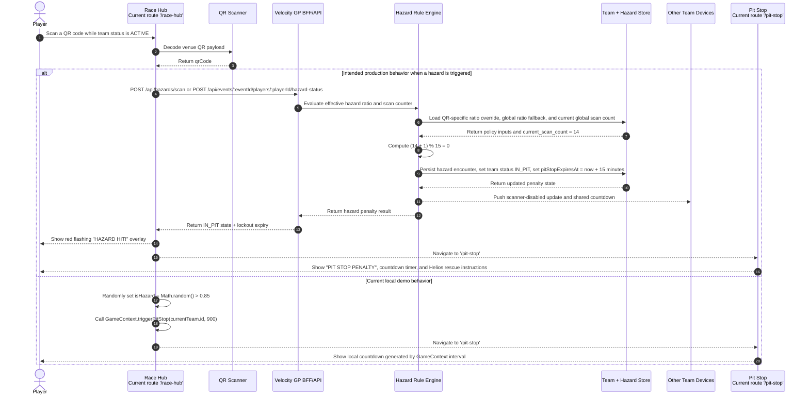
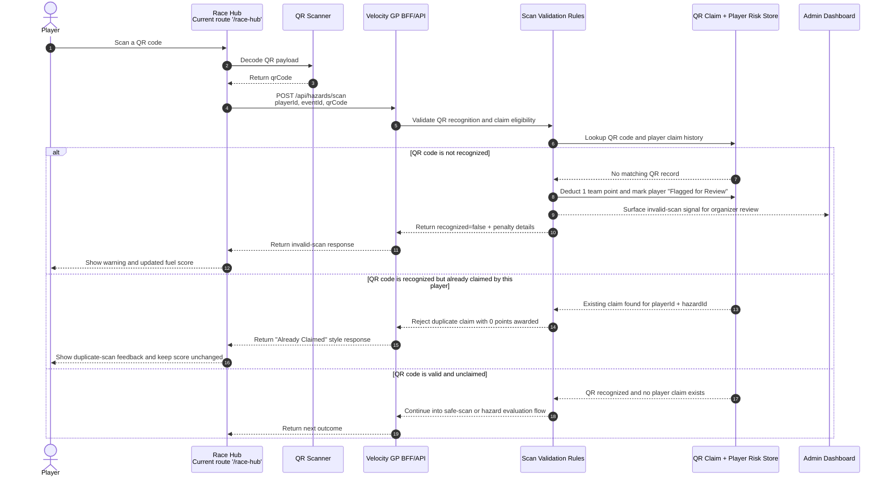
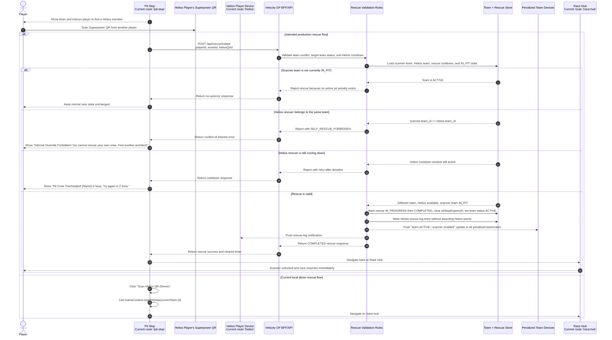
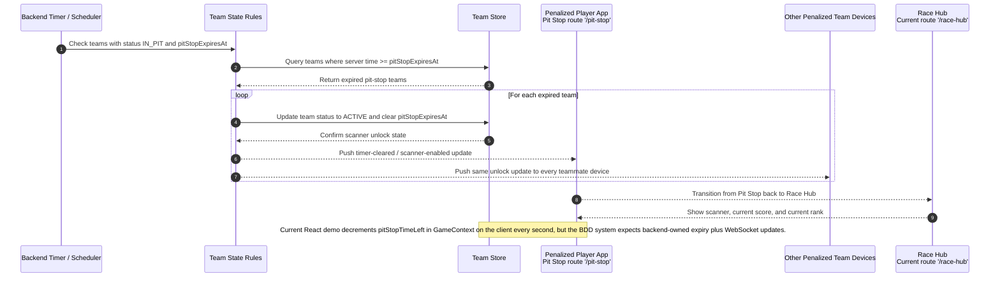
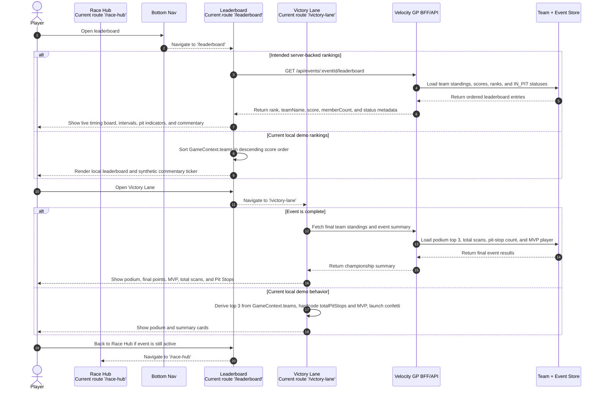

# Player Sequence Diagrams

This document shows how the Velocity GP application should behave for player actions using Mermaid sequence diagrams only. The persona BDD specs are the behavior source of truth, and current route/API names are included where they already exist in the app.

## Source References

- [Velocity GP BDD Specifications](./Velocity%20GP%20BDD%20Specifications.md)
- [Persona 1: Player Event Attendee](./persona/player-event-attendee.md)
- [Persona 2: Helios Player App Creator](./persona/helios-player-app-creator.md)
- [Persona 4: System Backend Sync](./persona/system-backend-sync.md)

## 1. Logging In and Authentication

## 2. Creating and Activating a Team in the Garage

## 3. Scanning a Safe QR Code and Earning Points

## 4. Hitting a Hazard and Entering Pit Stop

## 5. Scanning an Invalid or Duplicate QR Code

## 6. Rescuing a Team With a Helios Superpower QR

## 7. Auto-Releasing a Team When the Pit Stop Timer Expires

## 8. Opening the Leaderboard and Victory Lane

## Current Implementation Gaps

- `Login` currently jumps straight to `/garage`; the BDD flow expects magic-link authentication and team-state-based routing.
- `Garage` currently lets one player locally generate/finalize a team identity; the updated target flow collects every teammate's self-description first, then generates one team logo from all descriptions plus the preassigned team name.
- `RaceHub` currently resolves safe scans vs hazards randomly in local state; the BDD flow expects backend recognition, modulo-based hazard checks, and per-player claim enforcement.
- `PitStop` currently clears penalties with a local demo button; the BDD flow expects backend Helios rescue validation, self-rescue rejection, and cooldown handling.
- `HeliosProfile` currently enables Helios mode on page visit; the BDD flow expects role assignment to be controlled by event/admin rules.
- `Leaderboard` and `VictoryLane` currently derive most results from `GameContext`; the BDD flow expects backend-backed standings and event completion data.

## Diagram Reading Notes

- Every section is a Mermaid `sequenceDiagram` focused on one player action or one system reaction.
- `alt` branches separate intended BDD behavior from current local demo behavior where the implementation is still mocked.
- Route names and API paths are written exactly as they currently appear in the React router and BFF route contracts when available.
