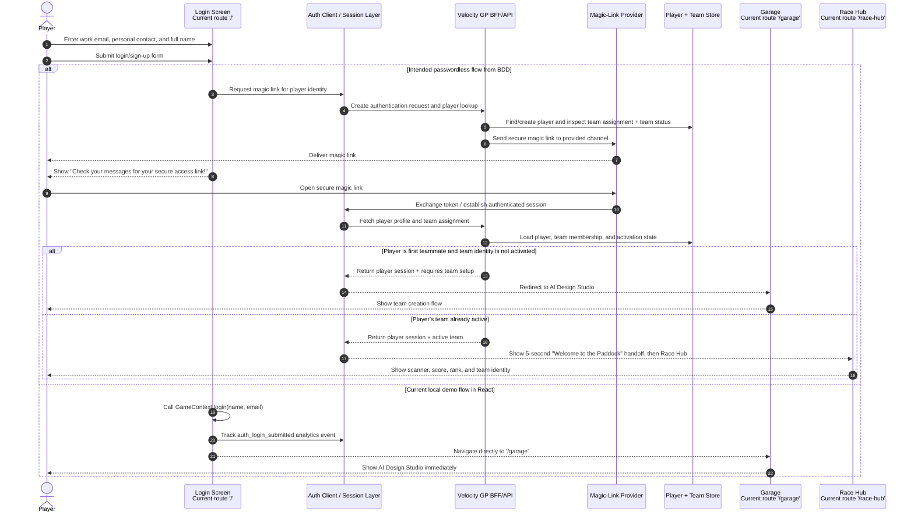
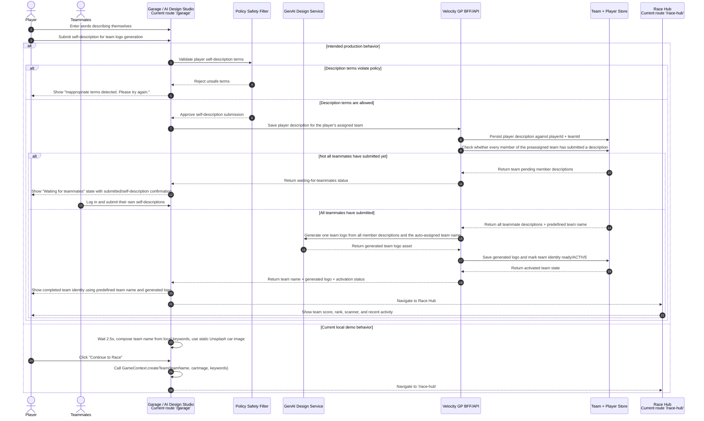
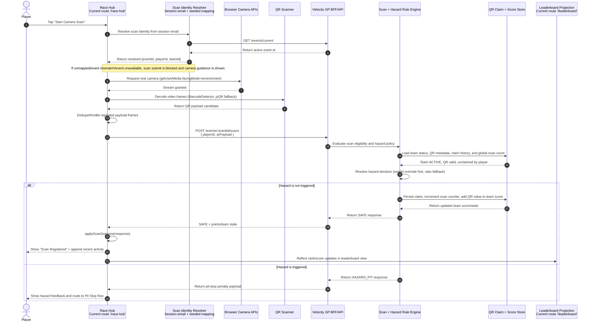
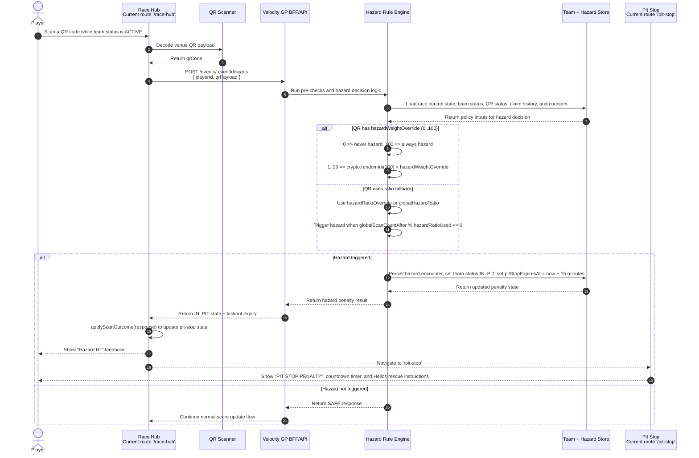
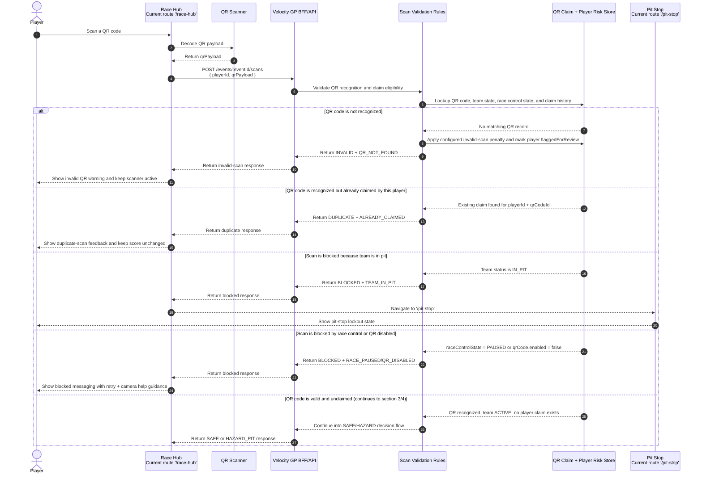
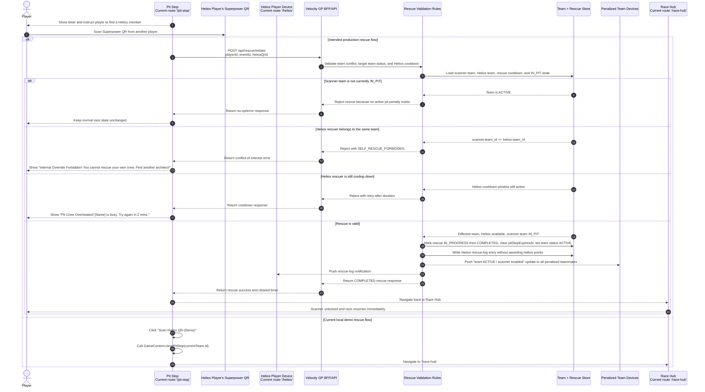
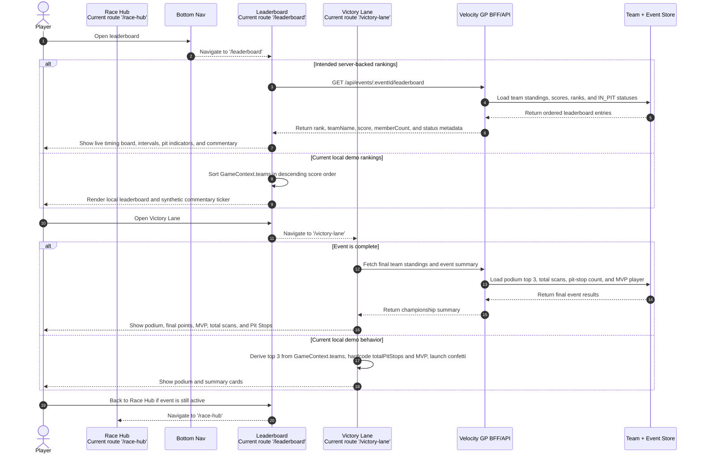

# Player Sequence Diagrams

This document shows how the Velocity GP application should behave for player actions using Mermaid sequence diagrams only. The persona BDD specs are the behavior source of truth, and current route/API names are included where they already exist in the app.

## Source References

- [Velocity GP BDD Specifications](./Velocity%20GP%20BDD%20Specifications.md)
- [Persona 1: Player Event Attendee](./persona/player-event-attendee.md)
- [Persona 2: Helios Player App Creator](./persona/helios-player-app-creator.md)
- [Persona 4: System Backend Sync](./persona/system-backend-sync.md)

## 1. Logging In and Authentication



## 2. Creating and Activating a Team in the Garage



## 3. Scanning a Safe QR Code and Earning Points



## 4. Hitting a Hazard and Entering Pit Stop



## 5. Scanning an Invalid, Duplicate, or Blocked QR Code



## 6. Rescuing a Team With a Helios Superpower QR



## 7. Auto-Releasing a Team When the Pit Stop Timer Expires

```mermaid
sequenceDiagram
  autonumber
  participant Scheduler as Backend Timer / Scheduler
  participant Rules as Team State Rules
  participant Store as Team Store
  participant PlayerApp as Penalized Player App<br/>Pit Stop route '/pit-stop'
  participant Teammates as Other Penalized Team Devices
  participant RaceHubUI as Race Hub<br/>Current route '/race-hub'

  Scheduler->>Rules: Check teams with status IN_PIT and pitStopExpiresAt
  Rules->>Store: Query teams where server time >= pitStopExpiresAt
  Store-->>Rules: Return expired pit-stop teams

  loop For each expired team
    Rules->>Store: Update team status to ACTIVE and clear pitStopExpiresAt
    Store-->>Rules: Confirm scanner unlock state
    Rules-->>PlayerApp: Push timer-cleared / scanner-enabled update
    Rules-->>Teammates: Push same unlock update to every teammate device
  end

  PlayerApp-->>RaceHubUI: Transition from Pit Stop back to Race Hub
  RaceHubUI-->>PlayerApp: Show scanner, current score, and current rank

  Note over PlayerApp,Store: Current app still decrements pitStopTimeLeft in GameContext on the client every second after scan responses seed pitStopExpiresAt; backend-owned realtime unlock push is not yet wired in the web client.
```

## 8. Opening the Leaderboard and Victory Lane



## Current Implementation Gaps

- `Login` currently jumps straight to `/garage`; the BDD flow expects magic-link authentication and team-state-based routing.
- `Garage` currently lets one player locally generate/finalize a team identity; the updated target flow collects every teammate's self-description first, then generates one team logo from all descriptions plus the preassigned team name.
- `RaceHub` now submits real scans to `POST /events/:eventId/scans`, but scan identity is still bridged by client-side seeded email mapping (no backend player-session bootstrap endpoint yet).
- Camera fallback in `RaceHub` is guidance + retry only; manual payload entry and image-upload fallback are intentionally not implemented in v1.
- `PitStop` currently clears penalties with a local demo button; the BDD flow expects backend Helios rescue validation, self-rescue rejection, and cooldown handling.
- `HeliosProfile` currently enables Helios mode on page visit; the BDD flow expects role assignment to be controlled by event/admin rules.
- `Leaderboard` and `VictoryLane` currently derive most results from `GameContext`; the BDD flow expects backend-backed standings and event completion data.

## Diagram Reading Notes

- Every section is a Mermaid `sequenceDiagram` focused on one player action or one system reaction.
- `alt` branches separate intended BDD behavior from current local demo behavior where the implementation is still mocked.
- Route names and API paths are written exactly as they currently appear in the React router and BFF route contracts when available.
